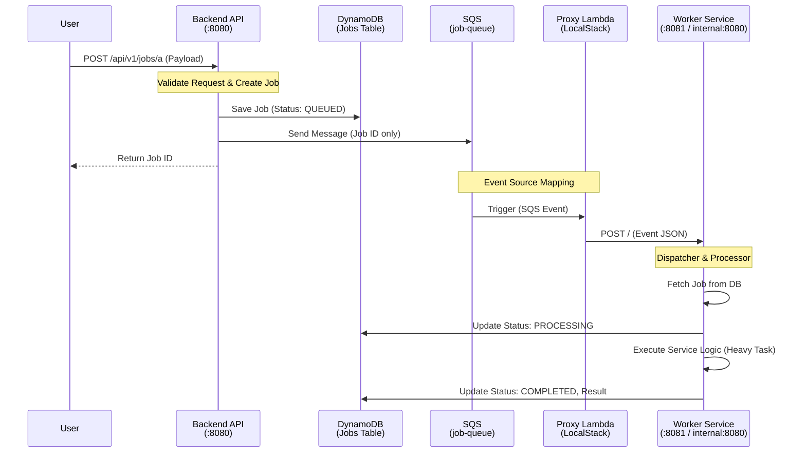

# Serverless Job Queue Template (FastAPI + SQS + DynamoDB)

Backend API (FastAPI) と Worker (非同期処理) を分離し、**共通のドメインロジック**を用いて型安全にジョブを処理するサーバーレスアーキテクチャのテンプレートです。

## 技術スタック

- **Language**: Python 3.12+
- **Web Framework**: FastAPI
- **Queue**: AWS SQS
- **Database**: Amazon DynamoDB
- **Infrastructure**: Docker Compose, LocalStack (for local dev)
- **Package Manager**: `uv` (Faster pip alternative)
- **Testing**: Pytest

## システムアーキテクチャ

このプロジェクトは **「BackendとWorkerの責務分離」** と **「コード共有 (Common)」** をコンセプトに設計されています。



### コンポーネントの役割

- **Backend (`backend/`)**:
  - ユーザーからのHTTPリクエストを受け付け、即座にレスポンスを返す。
  - ジョブをDBに登録し、処理IDのみをSQSに投げる。
  - 重い処理は行わない。
- **Worker (`worker/`)**:
  - 非同期でバックグラウンド処理を行う。
  - AWS Lambda Web Adapter パターンを採用しており、HTTPサーバーとして動作する。
  - ローカル開発時は、LocalStack上の **Proxy Lambda** がSQSイベントをWorkerコンテナへHTTP転送する。
- **Common (`common/`)**:
  - BackendとWorkerで共有される「契約 (Contract)」と「ロジック」。
  - Schemas (Input/Output定義)、Service/Processorロジック、DB/SQS操作が含まれる。

## ディレクトリ構造

```plaintext
.
├── backend/            # APIサーバーの実装
│   └── app/src/
│       ├── domain/     # APIエンドポイント定義 (Router)
│       └── main.py     # FastAPIエントリポイント
├── worker/             # ジョブワーカーの実装
│   └── app/src/
│       ├── dispatcher.py # ジョブ振り分けロジック
│       └── router.py     # SQSイベント受信エンドポイント
├── common/             # 【重要】共有ライブラリ
│   ├── jobs/           # コアジョブシステム (Service, Processor)
│   ├── domain/         # 各ジョブの定義 (Schema, Payload)
│   └── infrastructure/ # AWSクライアント (Boto3 code)
├── docker-compose.yaml # ローカル開発環境構成
└── init_aws.sh         # LocalStack初期化スクリプト
```

## ローカル開発の始め方

Docker Composeを使用して、AWS環境ごとローカルに立ち上げます。

### 1. 起動

```bash
docker compose up --build
```

起動完了後、以下のサービスが利用可能になります。

- **Backend API**: `http://localhost:8080`
- **Worker Service**: `http://localhost:8081` (デバッグ用アクセス)
- **LocalStack**: `http://localhost:4566`

※ 初回起動時は `init_aws.sh` が実行され、DynamoDBテーブルとSQSキュー、Proxy Lambdaが自動作成されます。

### 2. 動作確認

**Job A の投入 (メッセージ処理)**

```bash
curl -X POST "http://localhost:8080/api/v1/a" \
     -H "Content-Type: application/json" \
     -d '{"text": "Hello, Serverless World!"}'
```

レスポンスで `job_id` が返ってきます。

**ステータス確認**

```bash
curl "http://localhost:8080/api/v1/a/{JOB_ID}"
```

Workerのログを確認すると、ジョブが処理された様子が見えます。

## 新しいジョブタイプの追加手順

このテンプレートは機能追加のメンテナンス性を重視しています。新しいジョブ（例: `Job D`）を追加するには以下の手順を行います。

### Step 1: 共有層に定義を追加 (`common/`)

1.  `common/domain/job_d/job_schemas.py` を作成し、`JobDPayload` (入力) と `JobDResult` (出力) を定義します。
2.  `common/jobs/schemas.py` の `JobType` Enumに `JOB_D` を追加します。

### Step 2: Workerにロジックを実装 (`worker/`)

1.  `worker/app/src/domain/job_d/service.py` を作成し、`process(payload: JobDPayload) -> JobDResult` メソッドを持つサービスクラスを実装します。
2.  `worker/app/src/dispatcher.py` の `JobDispatcher` クラスで、`JobType.JOB_D` の場合に上記のサービスを呼ぶように分岐を追加します。
3.  `worker/app/src/dependencies.py` でサービスのDI登録を行います。

### Step 3: APIエンドポイントを公開 (`backend/`)

1.  `backend/app/src/domain/api_d/schemas.py` を作成し、フロントエンド向けの Request/Response スキーマを定義します。
2.  `backend/app/src/domain/api_d/router.py` を作成し、`common` の `JobService` を呼び出してジョブを登録するエンドポイントを実装します。
3.  `backend/app/src/main.py` にルーターを登録(`include_router`)します。

## プロダクションデプロイ (AWS)

本構成は **AWS Lambda Web Adapter** の利用を前提としています。
Backend, Worker共にDockerfileを使用してコンテナイメージをビルドし、AWS Lambda (Container Image) としてデプロイ可能です。

- **Backend Lambda**: API Gateway または Function URL からのHTTPリクエストを処理。
- **Worker Lambda**: SQSトリガーを設定。Web AdapterがSQSイベントをHTTPリクエストに変換してコンテナ内のFastAPI(`POST /`)に渡します。

環境変数の設定などが必要ですが、コードの変更なしに本番環境へ移行可能です。
