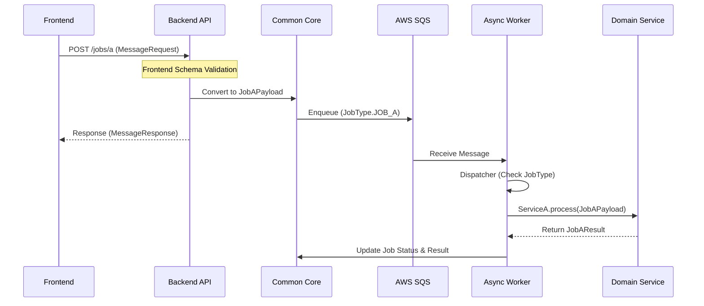

# リファクタリング後のアーキテクチャ設計と責務分離

本ドキュメントでは、マルチジョブ対応および API/Worker の責務分離を強化した新しいアーキテクチャについて解説します。

## 1. アーキテクチャの全体像

本システムは、**API (Backend)**、**Worker**、**Common (Shared Core)** の 3 つの主要コンポーネントで構成されています。
今回のリファクタリングにより、**「フロントエンドとの契約（API）」**と**「バックエンド内部の契約（Job）」**が明確に分離され、複数のジョブタイプを型安全に処理できる構造になりました。

### データフロー概要

---

## 2. レイヤー別責務とディレクトリ構造

### 2.1 Backend Layer (`backend/`)

**責務**: フロントエンド（クライアント）とのインターフェース。
HTTP リクエストのバリデーション、認証、レスポンスの整形を担当します。ジョブの具体的な処理ロジックは持ちません。

- **`src/domain/api_{a,b,c}/`**: ドメインごとにエンドポイントを分割。
  - **`schemas.py`**: **フロントエンド向け**のリクエスト/レスポンススキーマ定義。
    - 例: `MessageRequest` (ユーザー入力), `MessageResponse` (表示用データ)
  - **`router.py`**: エンドポイント定義。
    - リクエストを受け取り、`common`層の `JobService` を呼び出してジョブを登録します。
    - ジョブの結果（`JobResult`）をフロントエンド用のレスポンス形式に変換して返します。

### 2.2 Common Layer (`common/`)

**責務**: システム全体で共有されるドメイン知識、インフラ実装、および API と Worker 間の契約（Contract）。

- **`domain/job_{a,b,c}/job_schemas.py`**: **システム内部向け**のジョブ定義。
  - **`JobPayload`**: ジョブ実行に必要な入力データ（不変）。
  - **`JobResult`**: ジョブ実行結果のデータ構造（不変）。
  - これらは API と Worker が SQS/DB を介して通信するための共通言語として機能します。
- **`jobs/schemas.py`**: ジョブ全体のメタデータ定義。
  - `JobType`: ジョブの種類を識別する Enum。
  - `Job`: DB に保存されるジョブエンティティ。
- **`jobs/processor.py`**: Worker の汎用的な実行エンジン。
  - `JobDispatcher` プロトコルを定義し、具体的な処理を Worker 層に委譲します。

### 2.3 Worker Layer (`worker/`)

**責務**: 重い処理の実実行。ビジネスロジックの核心。

- **`src/domain/job_{a,b,c}/service.py`**: 具体的なジョブ処理ロジック。
  - 入力: `JobPayload` (Typed)
  - 出力: `JobResult` (Typed)
  - 純粋な Python クラスとして実装され、HTTP やフレームワークに依存しません。
- **`src/dispatcher.py`**: ジョブの振り分け。
  - `JobType` を見て、適切な `Service` を呼び出します。
  - 型安全な `JobResult` を受け取り、インフラ層が保存可能な形式（Dict）に変換します。

---

## 3. スキーマ分離の重要性

今回の設計では、**「API Schema」**と**「Job Schema」**を意図的に分離しています。

| スキーマ種類   | 定義場所                    | 用途                   | 特徴                                                                 |
| :------------- | :-------------------------- | :--------------------- | :------------------------------------------------------------------- |
| **API Schema** | `backend/.../schemas.py`    | フロントエンドとの通信 | UI の都合（表示形式、入力補助）に合わせる。バリデーションが厳格。    |
| **Job Schema** | `common/.../job_schemas.py` | API⇔Worker 間の通信    | 処理に必要な最小限のデータ。システム内部の契約なので変更頻度は低い。 |

**メリット**:

1.  **変更への強さ**: UI の変更（表示項目の追加など）が、バックエンドのジョブ処理ロジックに影響を与えません。
2.  **セキュリティ**: 内部的な計算結果や中間データを、意図せず API レスポンスとして露出するリスクを防げます。
3.  **型安全性**: Worker 内でも `Dict` ではなく Pydantic モデル (`JobPayload`, `JobResult`) を扱うことで、開発時の補完やエラー検知が効きます。

## 4. ディレクトリ構造の対応関係

機能（Feature）ごとに垂直に分割された構造を採用しています。

| Feature   | API Layer (Interface)           | Common Layer (Contract) | Worker Layer (Implementation)  |
| :-------- | :------------------------------ | :---------------------- | :----------------------------- |
| **Job A** | `backend/app/src/domain/api_a/` | `common/domain/job_a/`  | `worker/app/src/domain/job_a/` |
| **Job B** | `backend/app/src/domain/api_b/` | `common/domain/job_b/`  | `worker/app/src/domain/job_b/` |
| **Job C** | `backend/app/src/domain/api_c/` | `common/domain/job_c/`  | `worker/app/src/domain/job_c/` |

この構造により、新しいジョブタイプを追加する際は、これら 3 つのディレクトリにファイルを追加するだけで済み、既存コードへの影響を最小限に抑えることができます。
