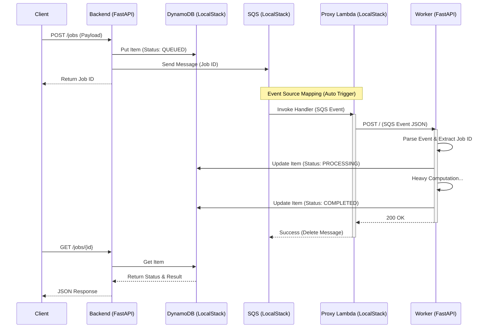

# **Serverless Event-Driven Architecture with LocalStack**

## **1. アーキテクチャ概要**

本プロジェクトは、FastAPI をフロントエンド（API）とし、重い処理を非同期のワーカーに委譲するサーバーレスアーキテクチャを採用しています。
ローカル開発環境（LocalStack）において、AWS Lambda の動作をコンテナベースで再現するために、**「Proxy Lambda パターン」**を採用しています。

### **Proxy Lambda パターンとは**

LocalStack 上の Lambda 関数は、実際のビジネスロジックを実行するのではなく、**「SQS からのイベントを受け取り、Worker コンテナへ HTTP 転送する」**という役割のみを担います。
これにより、以下のメリットが得られます：

1.  **ホットリロード**: Worker は通常の Docker コンテナとして動作するため、コード変更が即座に反映されます。
2.  **デバッグ容易性**: Worker コンテナに対して直接デバッガを接続可能です。
3.  **本番との整合性**: 本番環境（AWS Lambda Container Image）では、AWS 提供の「Lambda Web Adapter」等を使用することで、同じ FastAPI アプリケーションをそのまま Lambda として動作させることが可能です。

### **システム構成図**



## ---

## **2. ディレクトリ構成**

`backend`（API）と `worker`（処理担当）の 2 つのサービスに分割されていますが、ドメインロジックやインフラコードは `common` ディレクトリで共有しています。

```plaintext
.
├── docker-compose.yaml      # インフラ定義 (Backend, Worker, LocalStack)
├── init_aws.sh             # AWSリソース初期化 & Proxy Lambda作成
├── common/                 # 【共有】ビジネスロジック、DB操作、定義
│   ├── jobs/               # JobService, JobProcessor
│   └── infrastructure/     # DynamoDB, SQSクライアント
├── backend/                # 【API】FastAPIサーバー
│   ├── Dockerfile.dev
│   └── app/src/main.py
└── worker/                 # 【Worker】ジョブ実行サーバー
    ├── Dockerfile.dev
    └── app/src/
        ├── main.py         # HTTPサーバー (イベント受信)
        └── handler.py      # 実際の処理ロジック
```

## ---

## **3. 設定ファイル詳細**

### **docker-compose.yaml**

3 つのサービスが連携して動作します。`backend` と `worker` は `common` ディレクトリをマウントし、コード共有を実現しています。

```yaml
services:
  # --- 1. API Server ---
  backend:
    build:
      context: ./backend
      dockerfile: Dockerfile.dev
    volumes:
      - ./backend/app:/app
      - ./common:/app/common # 共有コードのマウント
    ports:
      - "8080:8080"
    depends_on:
      - localstack

  # --- 2. Worker Server ---
  worker:
    build:
      context: ./worker
      dockerfile: Dockerfile.dev
    volumes:
      - ./worker/app:/app
      - ./common:/app/common # 共有コードのマウント
    ports:
      - "8081:8080" # ホストからは8081でアクセス可能
    depends_on:
      - localstack

  # --- 3. AWS Mock (LocalStack) ---
  localstack:
    image: localstack/localstack:latest
    environment:
      - SERVICES=sqs,dynamodb,lambda
      - LAMBDA_DOCKER_NETWORK=app-network # Lambdaを同じNWに参加させる
    volumes:
      - "./init_aws.sh:/etc/localstack/init/ready.d/init_aws.sh"
```

### **init_aws.sh (初期化スクリプト)**

このスクリプトの重要な役割は、**「Proxy Lambda」**の作成です。

1.  **DynamoDB & SQS 作成**: 通常通りリソースを作成。
2.  **Proxy Lambda 作成**:
    - Python 製の簡易スクリプト (`proxy.py`) を動的に生成し、Lambda としてデプロイします。
    - このスクリプトは、受け取ったイベントをそのまま `http://worker:8080` へ POST します。
3.  **イベントマッピング**: SQS にメッセージが入ると、この Proxy Lambda が起動するように設定します。

```bash
# (抜粋) Proxy Lambdaのロジックイメージ
def handler(event, context):
    url = "http://worker:8080"
    # SQSイベントをそのままWorkerコンテナへ転送
    req = urllib.request.Request(url, data=json.dumps(event).encode('utf-8'), ...)
    urllib.request.urlopen(req)
```

## ---

## **4. アプリケーションコード**

### **common/ (共有ロジック)**

API と Worker で共通して使用する「ドメインロジック」です。

- `common/jobs/services.py`: API が使用。ジョブの登録など。
- `common/jobs/processor.py`: Worker が使用。ジョブの実行フロー制御。

### **backend/app/src/main.py (API)**

通常の FastAPI アプリケーションです。

- `POST /jobs`: `JobService` を呼び出して DynamoDB へ登録し、SQS へ送信します。

### **worker/app/src/main.py (Worker)**

SQS イベントを受け取るための Web サーバーとして動作します。

- `POST /`: Proxy Lambda から転送された SQS イベント（JSON）を受け取ります。
- イベント内の `body` (Job ID) を取り出し、`common` の `JobProcessor` に処理を委譲します。

## ---

## **5. 実行と確認手順**

### **ステップ 1: 起動**

```bash
docker compose up
```

`localstack` コンテナのログで `=== AWS Resource Setup Complete ===` が表示されるまで待ちます。

### **ステップ 2: ジョブの投入**

```bash
curl -X POST "http://localhost:8080/jobs" \
     -H "Content-Type: application/json" \
     -d '{"payload": "test-task"}'
```

### **ステップ 3: 処理の確認**

- **Backend ログ**: リクエスト受信ログ。
- **LocalStack ログ**: Proxy Lambda の起動ログ (`Forwarding event to: http://worker:8080`)。
- **Worker ログ**: 実際の処理ログ (`[Worker] Processing payload: ...`)。

### **ステップ 4: 結果の取得**

```bash
curl "http://localhost:8080/jobs/{job_id}"
```

## ---

## **6. 本番環境 (AWS) への適用**

この構成は「Lambda Web Adapter」を使用するパターンと非常に親和性が高いです。

| コンポーネント | ローカル (LocalStack)            | 本番 (AWS Cloud)                  |
| :------------- | :------------------------------- | :-------------------------------- |
| **API**        | Docker Container (FastAPI)       | AWS App Runner / ECS / Lambda     |
| **Worker**     | Docker Container (FastAPI)       | **AWS Lambda (Container Image)**  |
| **接続**       | Proxy Lambda -> Worker Container | **Lambda Web Adapter -> FastAPI** |

本番環境では、Worker の Docker イメージに `aws-lambda-web-adapter` を組み込むだけで、SQS イベントを HTTP リクエストとして受け取れるようになります。ローカルの `Proxy Lambda` は、この「Web Adapter」の挙動を模倣していると言えます。
